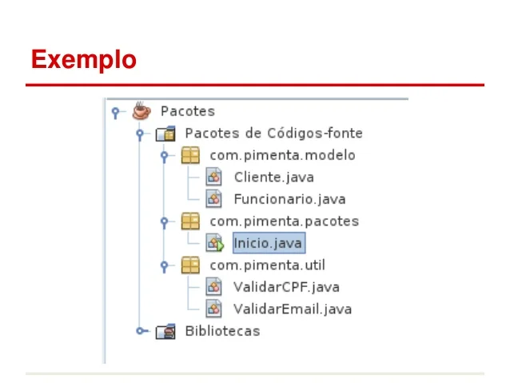

# Anatomia de Classes em Java

## O que é uma classe?
* Classe é um tipo de estrutura que define o comportamento e as características de um objeto.
* Uma classe é uma espécie de "planta" ou "molde" a partir do qual você pode criar objetos individuais. 
* Ela descreve quais propriedades (atributos) um objeto terá e quais ações (métodos) ele será capaz de realizar.
* Portanto, a classe organiza e estrutura o código, encapsula dados e funcionalidades relacionados em uma única unidade, promovendo a modularidade e a reutilização de código.

> Um objeto é uma entidade fundamental que representa um conceito do mundo real ou um sistema abstrato que em um ambiente computacional encapsula atributos e métodos que definem suas características e funcionalidades.

## Estrutura de uma classe

- `public`: palavra reservada da linguagem Java que é um modificador de acesso. Ela indica que o elemento ao qual está associada é acessível a partir de qualquer outro código em qualquer pacote do programa.
- `class`: palavra reservada que inicia as classes.
- `MinhaClasse`: toda classe precisa de nome, exemplo MinhaClasse(nomes de classes começam com letra maiúscula e se possuirem mais de uma palavra as demais palavras  também iniciarão em letra maiúscula).
- `{}`: após o nome, define o corpo { } , onde iremos compor nossas classes com atributos e métodos.

```java
public class MinhaClasse {
    // atributos e métodos
}
```

> O nome do arquivo .java onde a classe será salva deve ser idêntico ao nome da classe.

## Organizando classes

À medida que nosso sistema vai evoluindo, surgem novas classes (código fonte) em nossa estrutura de arquivos do projeto. Isso exige que seja realizado uma organização destes arquivos através de pacotes (packages).



Com o uso de pacotes, as nossas classes (.java) passam a possuir duas identificações, o nome simples e nome qualificado:

Nome Simples: Nome do arquivo, exemplo ContaBanco.

Nome Qualificado: Nome do pacote + nome do arquivo, exemplo: com.suaempresa.ContaBanco.

## Referência

- [https://glysns.gitbook.io/java-basico](https://glysns.gitbook.io/java-basico)